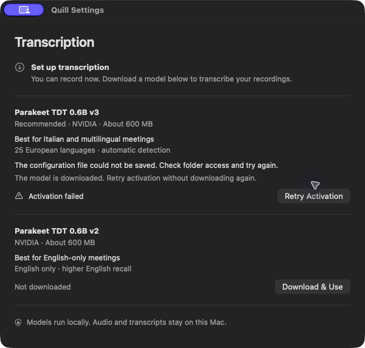
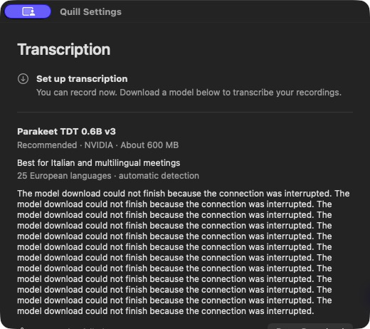
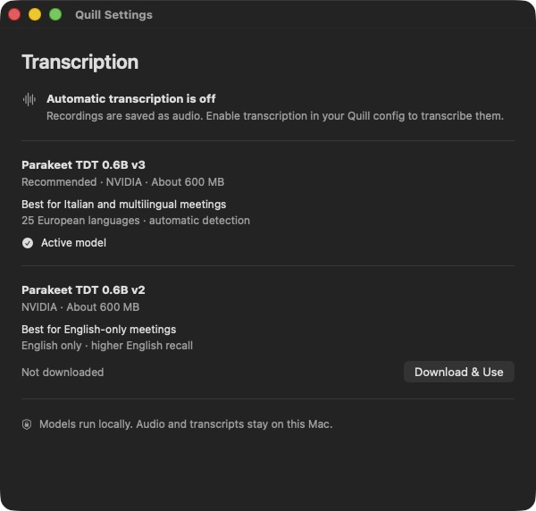

# Quill — complete native UI craft review

Reviewed September 6, 2026, at `c45672434811804ceedadb72dc4b01bb47abaf3b`, on `codex/ui-craft-review`, after `git pull --ff-only origin main`. Origin is `https://github.com/Matteo-Muscio/quill-clone.git`. This delivery is a review, evidence, and proposed implementation order. This documentation-only change leaves production source, configuration, and the installed app unchanged.

## Assessment and visual direction

Quill already has a coherent, restrained native foundation. Preserve it. The largest remaining weaknesses are inaccurate or incomplete state communication, recovery actions that disappear below long errors, and model metadata that receives more visual emphasis than the user's choice. A wholesale visual redesign would deliver less value than resolving those issues.

**Direction: a quiet recording instrument.** Keep one left-aligned reading column, system typography, compact native rectangular controls, neutral semantic colors, hairline dividers, and generous separation between purposes rather than containers. Retain the feather as the identifying mark and SF Symbols for operational states. No additional imagery is needed. Lead model choices with their language/use case, with technical identity immediately below. Use native press/focus feedback as the dominant motion language; introduce no decorative entrances, springs, or looping effects. The timer and actual progress indicators already provide purposeful activity.

The existing design authority is [the native appearance plan](plans/2026-07-30-transcription-model-settings-design.md#native-macos-appearance), refined by [the September 5 UI delivery](ui-improvements-2026-09-05.md). Its early card terminology has been superseded by the actual divider-separated layout and current project instructions. The craft-ui web baseline is not a reason to replace macOS controls or import CSS shadow/radius scales.

## Design-system inventory

There is an established design language, but no separate named token module or token file in the current repository. Most visual tokens are semantic values inherited from SwiftUI/AppKit; custom layout values are local literals.

| Category | Current source of truth | Judgment |
| --- | --- | --- |
| Typography | `.title.weight(.semibold)` for the page; `.headline` for summaries/model headings; `.callout` for descriptions, state, actions' surrounding text; `.title3` summary icon | Coherent native scale. The same callout treatment does too many communication jobs within model rows. |
| Text and surface color | `.primary`, `.secondary`, `NSColor.windowBackgroundColor` | Preserve semantic appearance behavior. No parallel brand palette is warranted. |
| Iconography | 16 × 16 pt template feather; template SF Symbols for recording/warnings; SF Symbols in settings | Coherent function and identity. Do not replace the feather merely to make every icon share a vendor. |
| Layout | 24 pt page inset; 20 pt section gap; 18 pt model-row vertical inset | Good overall density at the default size. |
| Internal spacing | 3, 4, 6, 8, 10, 12 pt according to context | Not proof of visual inconsistency by itself. Document the roles before normalizing numbers. |
| Controls | Native bordered buttons, regular size, explicit 5 pt rounded rectangle | Fits the compact-control direction. Preserve native focus/press treatment. |
| Dividers, shadow | Native `Divider`; system window shadow; no custom card elevations | Appropriate for a menu-bar utility. |
| Window geometry | 600 × 540 pt default; 520 × 430 pt minimum content | Both inspected. The minimum is duplicated in SettingsView and SettingsWindowController. |
| Motion | System controls/progress; no custom transition tokens | No missing decorative motion to fill. Document deliberate absence. |

**Proposed token work, not applied:** document these roles in a small design-system reference, and share the duplicated minimum window size if implementation is approved. Preserve the existing values initially. A repository-wide spacing, color, or typography normalization requires a separate explicit decision under craft-ui; it is not part of this review.

## Ranked findings and recommendations

Ranking considers user impact, implementation risk, and fit with this small native product. Findings distinguish observed defects from design judgment. No recording/transcription safety guard should be weakened to make the UI appear responsive.

| Rank | Finding / proposed change | Impact | Risk | Fit |
| --- | --- | --- | --- | --- |
| 1 | Make blocked recording status truthful everywhere | High | Low–medium | Core |
| 2 | Reflect update reservation in controls and lock explanations | Medium | Low–medium | Core |
| 3 | Make activation-failure summary match its actual recovery action | Medium | Low | Core |
| 4 | Put recovery before unbounded error detail | Medium | Low–medium | Core |
| 5 | Scope the privacy sentence to what Quill controls | Medium | Low | Core |
| 6 | Give the disabled-transcription state a concrete route forward | Medium | Low for guidance; medium for a new setting | Core |
| 7 | Lead model comparison with language/use case | Medium | Low | Strong |
| 8 | Make transcription/recovery state discoverable outside an open menu | Medium | Medium | Strong |
| 9 | Complete accessibility preference and announcement verification | Potentially high; not yet measured | Low–medium | Core |
| 10 | Document the native token contract and close preview coverage gaps | Maintenance value | Low | Strong |

### 1. “Ready to record” remains visible when Start is disabled

**Confirmed with the production menu in a simulated preparation state:** the menu shows “Ready to record” followed by disabled “Start recording.” The explanation is only the disabled item's tooltip. Settings accurately explains that recording is unavailable. The unsaved-recording fixture also retains “Ready to record” above “Recording not saved.”

Source: [MenuBarController.swift](../Sources/quill/UI/MenuBarController.swift), `update`, `updateModelPreparation`, and `updatePendingSave` (lines 137–193). `updateAccessibilityValue` already prioritizes an unsaved recording for its tooltip/accessibility value, but the visible menu title and idle feather do not inherit that precedence.

Use a single presentation decision for visible status, tooltip, accessibility value, and availability. Suggested copy: “Preparing transcription model” or “Recording needs saving,” paired with the existing setup/retry action. Keep Stop available for an active recording. Consider a warning symbol when stopped audio needs metadata recovery, preserving the timer while recording.

Evidence: [preparation menu accessibility tree](ui-evidence/craft-review-2026-09-06/preparing-menu-ax.txt), [unsaved menu accessibility tree](ui-evidence/craft-review-2026-09-06/unsaved-menu-ax.txt). These are simulated states, not actual failed saves.

### 2. Update reservation looks like an available recording action

**Confirmed by source tracing and reproduced presentation:** `AppBusyState.canStartRecording` rejects `isPreparingUpdate`, but `syncBusyState` does not pass that reason to `MenuBarController.updateModelPreparation`. Start therefore remains enabled during a reservation and its handler returns without starting. Model actions are correctly locked, but Settings tells the user to finish recording or wait for transcription; neither describes the update.

Source: [Quill.swift](../Sources/quill/Quill.swift), busy-state properties (lines 97–113), `startSession` (235), and `syncBusyState` (353–364); [SettingsView.swift](../Sources/quill/UI/SettingsView.swift), summary (22–25) and action help.

Pass the actual lock reason through the UI and show “Preparing Quill update.” This is a presentation correction; retain the existing cooperative handoff and guard. The reservation can be brief, so it ranks below routine preparation/save states.

Evidence: [update-reservation menu tree](ui-evidence/craft-review-2026-09-06/update-menu-ax.txt). No updater was run during this review.

### 3. Activation failure contradicts the page summary

**Observed:** after a successful simulated download and failed config save, the row correctly says “The model is downloaded. Retry activation without downloading again.” The top summary still says “Download a model below.” Retrying the persistent simulated error keeps the correct row action but does not fix that contradiction.

Source: [SettingsView.swift](../Sources/quill/UI/SettingsView.swift), `ModelSettingsSummary` (34–41) and activation-failure detail (192–203).

Make the summary reflect whether a usable/downloaded model exists and the recovery needed: for example, “Model downloaded — activation needed.” Do not globally replace readiness with an error when an alternative model is still active and usable. Add a regression covering both situations.

### 4. Long errors push the recovery button below the fold

**Observed stress case:** at 520 × 430 pt, an injected long localized error consumes the viewport before “Retry Download” appears. Scrolling reaches the action, so it is not inaccessible through clipping; the weakness is prioritization and recovery effort.

Source: [SettingsView.swift](../Sources/quill/UI/SettingsView.swift), `ModelRow.body` places `stateDetail` before the state/action row (130–140), and renders the entire message without a bounded summary (192–203).

Put a short error title and Retry action first. Put selectable full diagnostics in a native disclosure below, preserving all text. Use error icon + wording, not color alone. Keep the first actionable step visible at minimum window size. The repeated synthetic message demonstrates layout behavior; it is not evidence that this exact error occurs in production.

### 5. The privacy footer promises more than the app can guarantee

**Source-backed wording issue:** “Audio and transcripts stay on this Mac” is unconditional, but Quill supports a configurable output directory and an arbitrary user-configured post-processing hook. A user can choose a synced destination or a hook that sends files elsewhere. Local inference is the claim Quill can substantiate.

Source: [SettingsView.swift](../Sources/quill/UI/SettingsView.swift):92, [Config.swift](../Sources/quill/Config.swift):5–18, [TranscriptionCoordinator.swift](../Sources/quill/Transcription/TranscriptionCoordinator.swift), `runHook` around line 294.

Suggested copy: **“Transcription runs on this Mac. Audio and transcripts are saved to your recordings folder.”** This is a factual wording correction, not evidence of unexpected transmission or a request for a security redesign.

### 6. Disabled transcription points to an unnamed config

**Observed:** Settings says “Enable transcription in your Quill config” but offers no path, link, or control. The remaining prominent action downloads another model, which does not enable transcription.

Source: [SettingsView.swift](../Sources/quill/UI/SettingsView.swift):26–29 and [Config.swift](../Sources/quill/Config.swift):44–45.

The smallest fix is selectable guidance naming `~/.config/quill/config.json` and `transcription.enabled`, with an Open Configuration action if appropriate. A native enable/disable setting would be more convenient but introduces a persistent-write flow and deserves its own scoped implementation. Keep choosing models possible while automatic transcription is off; make the distinction explicit.

### 7. Model rows prioritize technical identity over the decision

**Design judgment from live comparison:** the only bold row title is “Parakeet TDT 0.6B v3/v2,” while the useful distinction—multilingual versus English-only—is normal text beneath provider, recommendation, and download size. A first-time user must parse technical metadata before deciding.

Keep both complete model identities visible, but lead with “Italian & multilingual” and “English only,” then place model identity/provider/size together in subordinate text. Keep recommendation as plain text, not a badge. Preserve active-state text and native controls. Do not rename catalog identities used in CLI or saved metadata just to improve the visual heading.

The current default layout is already compact and readable. There is no justification for a card grid, sidebar, hero, or larger default window. Improve emphasis inside the existing row structure.

### 8. Recovery and transcription status are easy to miss when the menu is closed

**Source-backed gap, with live menu inspection:** normal background transcription and transcription failure appear in the menu's second line; the closed status item's tooltip/accessibility value only reflects recording or unsaved metadata. A user inspecting the feather cannot tell that transcription has failed without opening the menu. “Retry pending transcriptions” is also shown in the ready menu even when no failure is being displayed.

Source: [MenuBarController.swift](../Sources/quill/UI/MenuBarController.swift):71–77, 196–214 and [Quill.swift](../Sources/quill/Quill.swift):323–347.

Include a concise transcription status in the status-item tooltip/accessibility value without obscuring active recording or microphone warnings. Consider a restrained attention symbol for failure. Keep a manual recovery route discoverable; do not simply hide Retry based on a failed-state string if pending jobs can exist outside that state. Contextual menu placement should follow actual coordinator state.

### 9. Accessible structure is good; full assistive behavior remains unverified

Observed positives: headings are exposed, summary text is combined, model actions carry the full model name, progress exposes a numeric value, errors are selectable, and states use words/symbols rather than color alone. Escape cancellation worked; native menu keyboard selection returned to Settings. Light and dark text looked readable, and the minimum-size scroll area exposed its scroll actions.

Tab did not move focus into model buttons under the current machine preference. That is not sufficient evidence of an app defect: native button traversal follows macOS keyboard-navigation settings. No global preference was changed. A full VoiceOver pass, status-change announcement behavior, Increase Contrast, Reduce Transparency, larger text, accent variants, and reduced-motion preference testing remain outstanding. Semantic API use alone is not proof that all these combinations pass.

There is no custom animation to disable. Keep native busy feedback and avoid adding shimmer or entrance motion to compensate for state-copy issues. If announcements are added, announce meaningful transitions, not every timer tick or percentage change.

### 10. Record the design contract and improve the review fixture

The existing fixture compiles the real views but does not mirror all production busy-state wiring. For example, its Download scenario did not call `updateModelPreparation`, and its Recording scenario did not lock model choices. Missing scenarios included automatic transcription off, both models installed, unsaved metadata, updater reservation, and long errors. That can make screenshots look complete while integration states remain unchecked.

This review used an additional **temporary** fixture at `.build/ui-craft-review/preview.swift`, using the same compiled production views and fake operations. It passes the relevant production-equivalent flags for each added scenario. Its [archived patch](ui-evidence/craft-review-2026-09-06/preview-fixtures.patch) makes the scenario additions inspectable and reproducible against the base fixture. It is not a replacement AppController, and static injected state is not end-to-end integration verification. Production source and the tracked preview script remain unchanged.

In a future implementation pass, promote the missing states and realistic transition wiring into the maintained fixture, alongside a short native design-system reference. Avoid inventing a design-system framework for three UI files.

## Performance review

The interface has two model rows, no external fonts/assets, no custom blur/shadow stacks, no decorative animation, and no web runtime. No obvious lag appeared during the inspected fixture flows. The recording timer already stops when recording ends and runs in common run-loop modes while recording. No new timers or dependencies were added.

Two source-level opportunities are lower priority: `MenuBarController.update` recreates symbol images on recording ticks, and each published model progress update can invalidate the whole small settings view. Neither was measured as a bottleneck. Cache an image or coalesce unchanged progress only if profiling shows a material cost; do not add architecture on suspicion. Live audio capture, model download throughput, verification latency, CPU/energy profiling, and actual inference were not measured.

## Verification and evidence boundaries

| Check / flow | Result |
| --- | --- |
| Fresh native debug build via `bash scripts/build-ui-preview.sh` | Passed; production Swift views compiled and linked |
| Additional isolated review fixture build | Passed |
| `swift test --scratch-path .build/validation --filter 'MenuBarControllerTests\|ModelSettingsSummaryTests\|TranscriptionModelSettingsTests\|AppControllerStateTests'` | 48 tests passed, zero failures |
| Ready and pending-model setup | Operated native preview; inspected hierarchy and accessible names |
| Download → Escape cancel | Returned to usable model choices |
| Verification → click Cancel | Returned to setup controls |
| Download failure → Retry Download | Persistent simulated failure retained its recovery action |
| Activation failure → Retry Activation | Persistent simulated failure retained downloaded-model guidance |
| Both installed → Use v2 | Summary changed to v2; active/downloaded labels and available action changed correctly; persistence was a no-op |
| Locked, recording, microphone failure | Inspected disabled model controls and native menu status/Stop/repair route |
| Preparation, unsaved metadata, update reservation | Injected relevant flags; inspected production menu availability and captured AX evidence |
| Transcribing and transcription failure | Inspected queue/failure text and retry availability in menu |
| Light/dark appearance | Inspected through app-local fixture appearance controls |
| 600 × 540 and 520 × 430 pt content | Inspected; activation errors and long synthetic errors remained scrollable; lower actions reachable |
| Keyboard | Escape cancellation and menu type/arrows/Return route exercised; full Tab/VoiceOver audit not claimed |
| Notifications, folder/config/sound destination actions | Source reviewed; actual delivery/external destinations not exercised |

The native macOS app has no tablet/mobile/browser interface; web viewport checks, Lighthouse, React diagnostics, and web lint/typecheck do not apply. No formatter/linter configuration was found. A release rebuild/full unrelated test suite was not needed for this review-only artifact; the fresh debug build and focused state/menu tests were used. The existing FluidAudio unhandled `benchmark.md` resource warning remains.

No microphone/system audio was captured, no model was downloaded, no inference or billed model calls were used, and no installed binary or LaunchAgent was replaced. Notifications may be hidden by OS permissions/preferences and were not tested. Preview apps were closed after inspection. This review is comprehensive over the current UI source and enumerated simulated native states, with the above real-device and assistive-technology limits.

Additional evidence: [ready in light appearance](ui-evidence/craft-review-2026-09-06/ready-light.png), [minimum-size error after scrolling](ui-evidence/craft-review-2026-09-06/compact-error-scroll.png), [successful model switch](ui-evidence/craft-review-2026-09-06/switched-model.png), [microphone-failure menu](ui-evidence/craft-review-2026-09-06/microphone-menu-ax.txt). Any purple capture glyph belongs to macOS/Codex, not Quill.

## Suggested implementation sequence

1. Correct availability/status precedence, updater lock reasons, activation-summary copy, and privacy wording; add targeted state regressions.
2. Reorder error recovery and clarify the disabled-transcription next step; preserve native keyboard/focus and complete full accessibility preference checks.
3. Rebalance model typography/use-case hierarchy in the current layout, then visually verify both appearances and minimum size again.
4. Document existing tokens and improve the maintained fixture. Consider closed-menu transcription feedback only with accurate coordinator state and clear priority rules.

No broader feature build—recordings browser, live meters, transcript viewer, or general Settings redesign—is necessary to deliver this polish pass.
