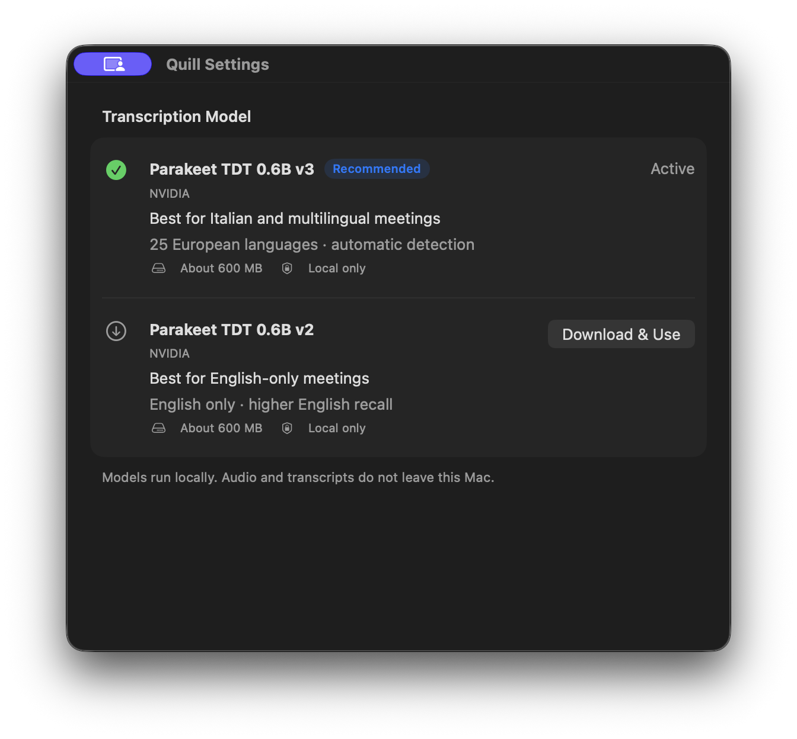
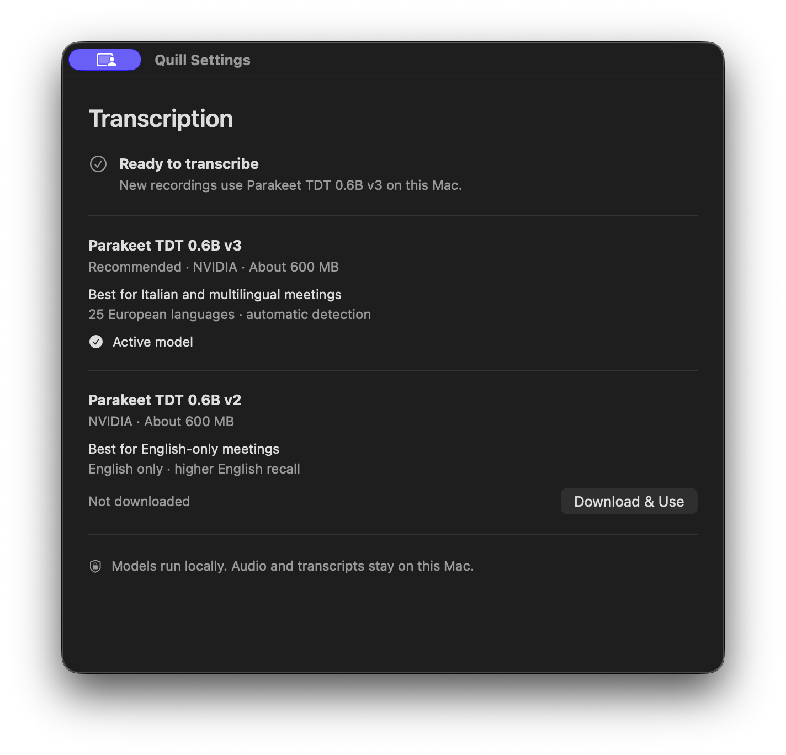
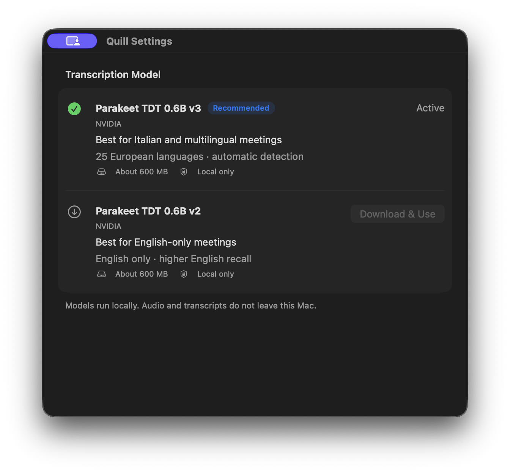
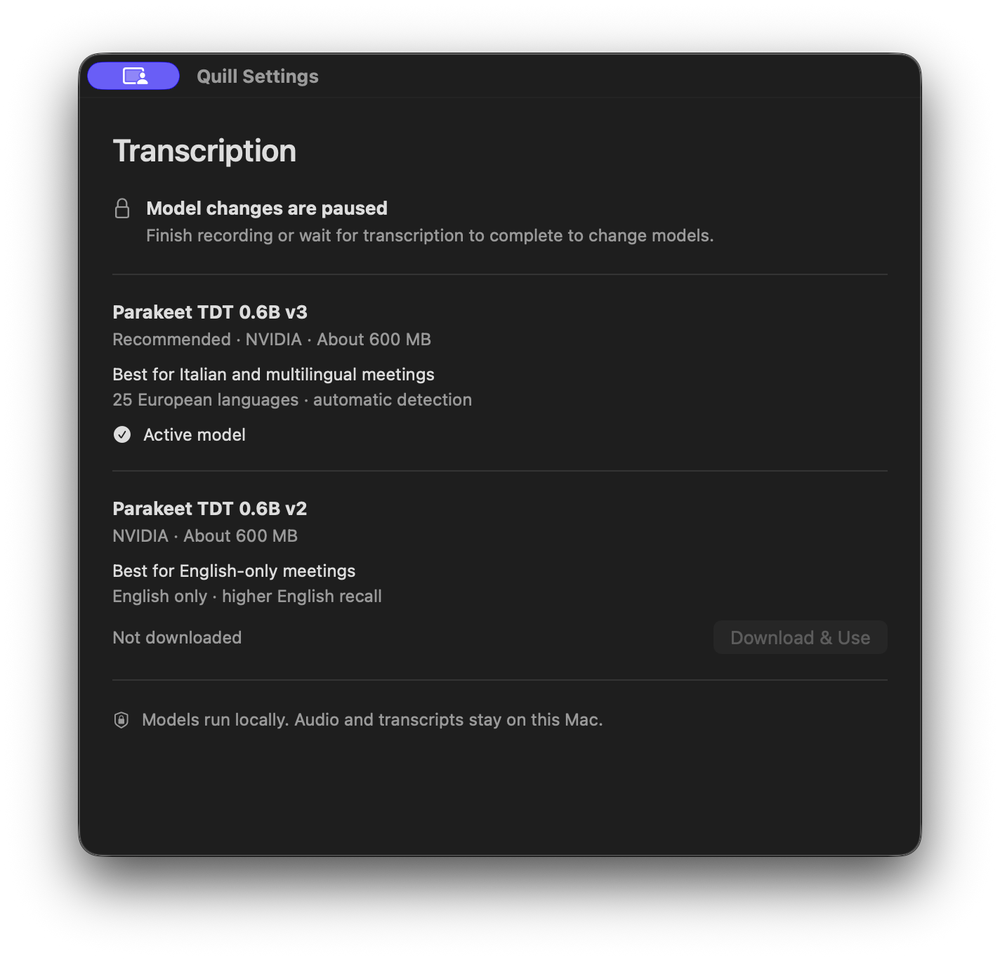
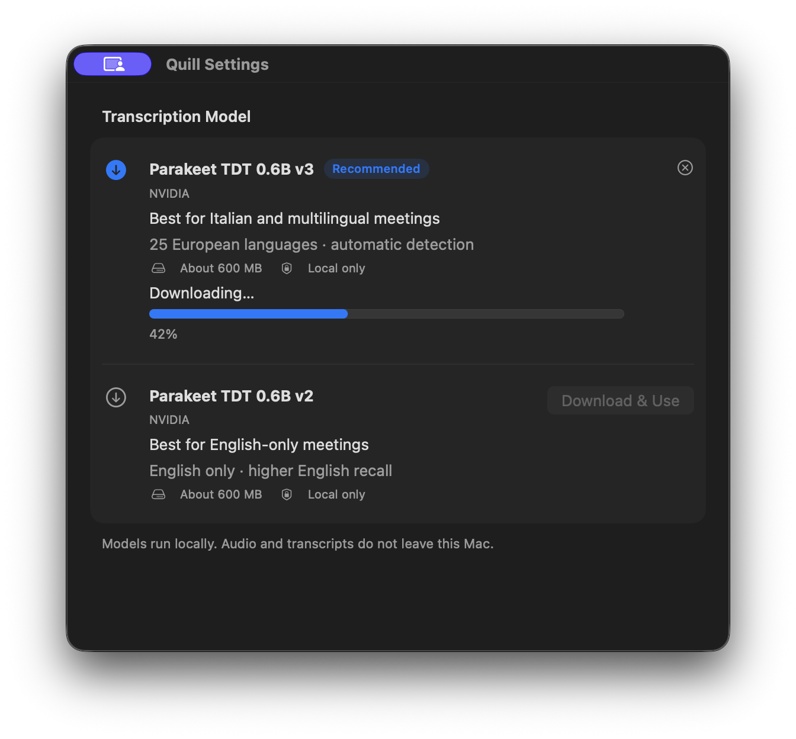
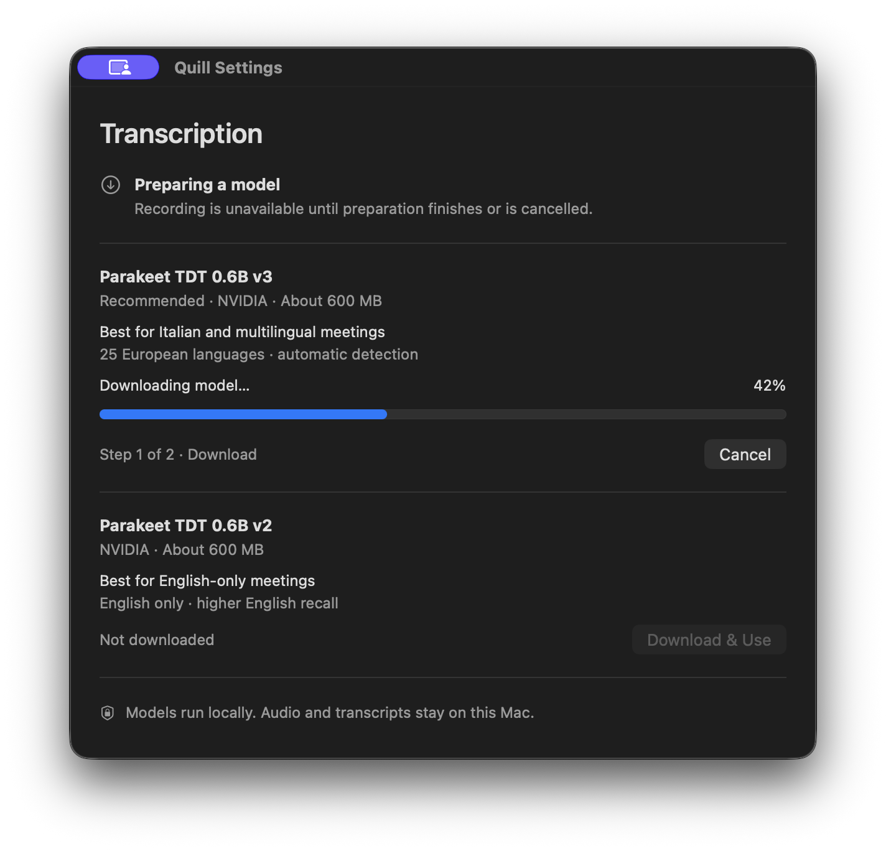
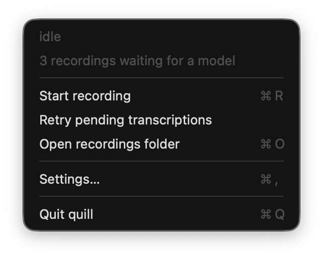
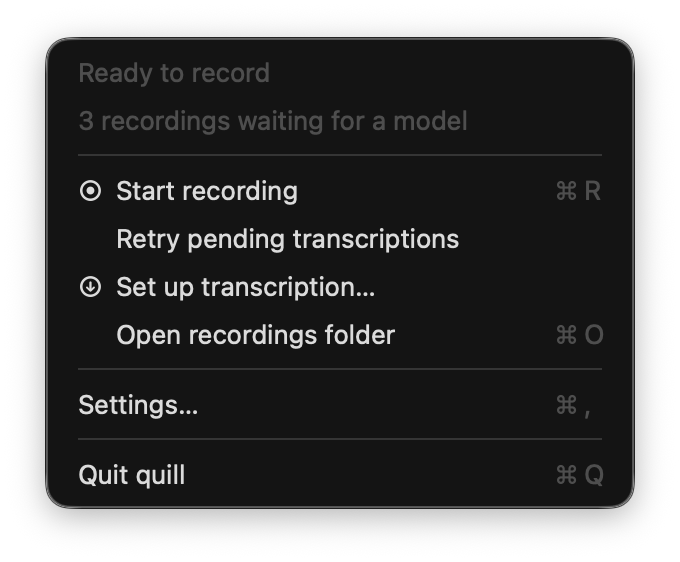

# Quill UI improvements — September 5, 2026

Base: `0d8ee436c01e27aa992902e0adbfcd894fde0d20`, pulled from `Matteo-Muscio/quill-clone/main`. Branch: `codex/ui-clarity-polish`. This is a native SwiftUI/AppKit menu-bar app. The scope is UI clarity, native interaction, and presentation; recording formats, transcription engines, configuration writes, and installed-app state are unchanged.

## Ranked opportunities

Ranking balances impact on the existing recording/transcription workflow, implementation risk, and product fit. High impact with low risk and core fit takes priority over broader features. The first five were selected and implemented.

| Rank | Improvement | User impact | Implementation risk | Fit | Inspection evidence / decision |
| --- | --- | --- | --- | --- | --- |
| 1 | Readable model choices and a clear settings hierarchy | High | Low | Core | Model names, recommendation capsules, descriptions, state icons, and actions competed horizontally in grouped rows. Use full-width descriptions, simple dividers, and separate action rows. |
| 2 | Recording elapsed time visible in the menu bar | High | Low | Core | The status item was icon-only even though README promised elapsed time. Show monospaced time in recording and microphone-failure states; restore the compact feather on stop. |
| 3 | Visible readiness, waiting, and locked-control guidance | High | Low | Core | Settings explained pending models but otherwise required interpreting icons or hovering a disabled action. Add a persistent state summary with a next step. |
| 4 | Clear preparation stages, cancellation, and recovery | Medium–high | Low | Core | Cancel was an icon, errors had generic Retry copy, and verification did not explain its place in preparation. Label both stages and offer explicit, keyboard-accessible cancellation and targeted recovery. |
| 5 | Direct setup from the waiting-recordings menu | Medium–high | Low | Core | The waiting message had no adjacent setup route. Add “Set up transcription…” using the existing Settings action, only while a model is needed. |
| 6 | Recent recordings with transcript shortcuts | High | Medium | Strong | Only the root folder is available in the menu. Requires filesystem listing, transcript availability, and stale-item handling. Deferred. |
| 7 | Live microphone and system-audio levels | High | High | Strong | Menu status cannot demonstrate audible input. Requires reliable metering across capture callbacks without compromising recording. Deferred. |
| 8 | Permission checklist with repair links | High | Medium | Strong | Diagnostics are mainly in the CLI; system-audio authorization cannot be queried without capture. Requires honest “unknown” states and TCC testing. Deferred. |
| 9 | Recordings-folder picker | Medium | Medium | Good | Destination changes require config/CLI. Needs decisions about active sessions, pending queue location, and persistent writes. Deferred. |
| 10 | Searchable transcript viewer | High | High | Broader scope | Reading currently uses exported files. Requires a new main UI, indexing/search, and document lifecycle. Deferred. |

## Evidence for the five implemented changes

All images below are **actual macOS screenshots of Quill's compiled production views**, rendered by an isolated native fixture app. Model installation, progress, failures, and recording indicators use deterministic simulated operations. The screenshots are not mockups and do not demonstrate real audio capture or inference. Baseline images use the preserved binary built from `0d8ee43`; after images use the changed UI. Settings are shown at their respective default content sizes: 560 × 480 before, 600 × 540 after. The native minimum content size is 520 × 430. Any purple screen-sharing glyph is macOS/Codex capture UI, not a Quill feature.

### 1. Readable settings

`SettingsView.swift` replaces grouped cards and the recommendation capsule with heading-led, divider-separated rows. Full model names and language guidance use the available width; download actions occupy a distinct lower row. Native semantic colors, system fonts, rectangular controls, and scrolling are retained. `SettingsWindowController.swift` provides more useful default space and applies the minimum to content, excluding title-bar height.

Verified the active and uninstalled states, full accessible model names, both appearances, and scrolling to the second model action/footer at minimum size with a long error.

| Before | After |
| --- | --- |
|  |  |

### 2. Visible recording duration

`MenuBarController.update` shows monospaced elapsed time alongside the recording/warning icon and includes it in the tooltip and accessibility value. Stopping clears the time. Unsaved-recording warnings keep priority. The existing one-second timer now uses common run-loop modes so it continues while a menu tracks input; no second timer was added.

`testRecordingTimerRemainsVisibleAfterMicrophoneFailureAndResetsWhenStopped` covers normal recording, microphone failure, idle reset, and missing elapsed input. `testPendingSaveRemainsTheAccessibleStatusUntilResolved` covers warning priority. Native captures show the real status item with a fixed fixture time of 12:34.

| Before | After |
| --- | --- |
|  |  |

Microphone-failure state: 

### 3. Visible state and next steps

The settings summary distinguishes model preparation, locked model changes, disabled automatic transcription, pending recordings, readiness, and first setup. It explains how waiting recordings resume and why controls are unavailable. Disabled transcription does not incorrectly promise readiness or automatic resume.

Seven `ModelSettingsSummaryTests` cover state precedence, selected-but-unavailable models, the actual active model name, singular/plural pending counts, preparation/recording locks, disabled transcription, and reopening Settings after the config changes. The native accessibility tree exposes the summary as combined text. Visual checks confirm the lock explanation is visible without hovering.

| Before | After |
| --- | --- |
|  |  |

Pending setup comparison: [before](ui-evidence/before-setup.png) · [after](ui-evidence/after-setup.png).

### 4. Preparation and recovery controls

Download progress has a visible percentage and “Step 1 of 2”; verification has an indeterminate indicator and “Step 2 of 2.” Cancel is a labeled native button with Escape support. Errors are selectable text, with **Retry Download** or **Retry Activation**. An activation error explicitly says the model is already downloaded.

In the live fixture, clicking Cancel and pressing Escape each restored usable model choices. Verification displayed its separate stage. Persistent activation errors remained visible after retry. Existing `ModelManagerTests` cover cancellation, failed downloads, activation retry without redownloading, locked actions, progress ordering, and stale-state races. No model was downloaded for validation.

| Before | After |
| --- | --- |
|  |  |

Additional recovery evidence: [failure before](ui-evidence/before-failure.png) · [failure after](ui-evidence/after-failure.png) · [activation failure](ui-evidence/after-activation-failure.png).

### 5. Contextual transcription setup

The native menu adds **Set up transcription…** when the coordinator reports recordings waiting for a model. It routes to the existing settings window and disappears for idle, active transcription, and failed-job statuses. Existing recording, save retry, and transcription retry actions remain intact.

`testWaitingForModelShowsSetupActionAndClearsItForOtherStatuses` verifies visibility, callback dispatch, status transitions, and the existing Settings shortcut. In the live menu, keyboard type selection, arrows, and Return activated setup and returned to Settings.

| Before | After |
| --- | --- |
|  |  |

## Complete validation

Apple Swift 6.3.3 on macOS 26, Apple Silicon. The repository defines no formatter/linter configuration and no GitHub Actions workflows; there is no remote CI suite to label green. The complete existing Swift test suite was run in both configurations, including audio-recovery, recording metadata, model-management, coordinator, and native-menu tests.

| Check | Result |
| --- | --- |
| `swift test --scratch-path .build/validation --enable-code-coverage` | 103 tests passed, 0 failures |
| `swift test --scratch-path .build/validation -c release` | 103 tests passed, 0 failures |
| `swift build --scratch-path .build/validation -c release` | Passed |
| Release `quill --help` and `quill run --help` | Both exited 0 |
| Release `quill doctor` | Exited 0; microphone, destination, installed v3 model OK |
| `scripts/build-ui-preview.sh` | Built and launched the native fixture using actual compiled Quill views |
| `bash -n scripts/build-ui-preview.sh` | Passed |
| `git diff --check` | Passed |
| Native interaction / appearance | Setup via keyboard, Cancel via click and Escape, waiting/locked/preparing/error/active states, minimum-size scrolling, light/dark appearance |

Ten new regression tests were added to the previous 93-test suite. Local logs are retained under `.build/ui-evidence/`: `debug-tests.log`, `release-tests.log`, `release-build.log`, `cli-help.log`, `cli-run-help.log`, `doctor.log`, and `preview-build.log`.

The existing FluidAudio unhandled `benchmark.md` resource warning remains. `doctor` reports system-audio authorization as unknown until first capture; this is not a new failure. Real microphone/system capture, hardware route changes, and real inference were not exercised by this UI pass. No installed Quill binary or LaunchAgent was replaced. Native Tab traversal follows the user's macOS keyboard-navigation preference; menu navigation and explicit Escape cancellation were verified, not a full VoiceOver audit. The changes add no dependencies, model calls, decorative animation, or extra polling.

Additional appearance/size evidence: [light appearance](ui-evidence/after-light.png) · [minimum-size scroll](ui-evidence/after-compact.png).

## Reproduce the native UI review

Run `scripts/build-ui-preview.sh`, then open the printed `.app` path. Its application menu offers Ready, Setup, Locked, Download, Verifying, Failure, Activation failure, Recording, and Microphone failure fixtures (Command–1 through Command–9). Command–M shows the production Quill menu. Appearance and size options affect only this fixture app. Download/cancel/retry controls operate on fake model operations; config persistence is a no-op or a simulated error. Quit the fixture with Command–Q.
